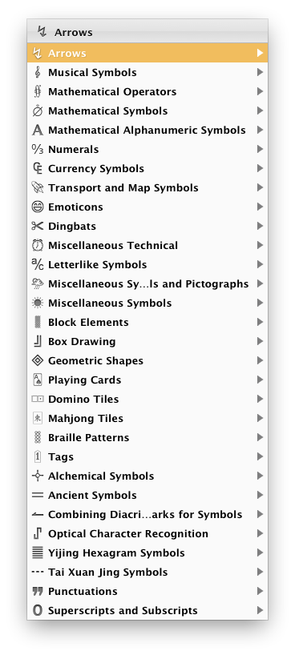
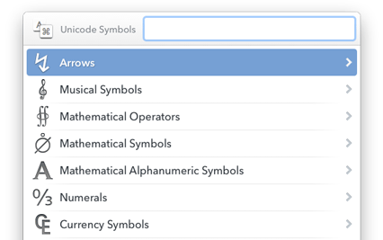

# Unicode Symbols for LaunchBar

A Collection of unicode symbols in [LaunchBar 6](http://obdev.at/products/launchbar).

- Inspired by [copypastecharacter.com](http://copypastecharacter.com)
- Over 9000 glyphs
- Live search
- Easy paste 
- Unicode 7.0.0

## Download

Get latest version from: https://github.com/nbjahan/launchbar-unisym/releases/latest

## Issues

- This action is a huge collection of vector graphics, it could take some time to show the lists
- Some icons are missing ...
